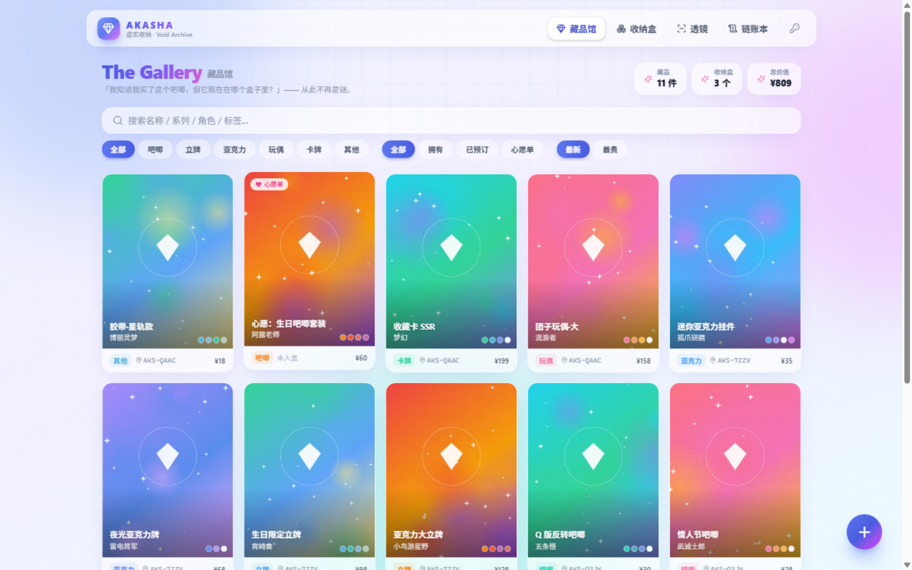
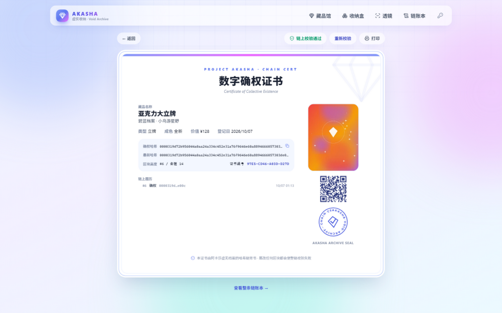

<div align="center">
  <h1>💠 Project Akasha</h1>
  <p>
    <strong>The Void Archive for Your Reality.</strong><br>
    为二次元实体收藏打造的「虚实共生」收纳系统。
  </p>

  <p>
    <a href="#-what-is-akasha">About</a> •
    <a href="#-features">Features</a> •
    <a href="#-快速开始">Quick Start</a> •
    <a href="#-部署到-cloudflare">Deploy</a>
  </p>

  
  
  
</div>

<br>

## 🌌 What is Akasha?

**Project Akasha (阿卡莎)** 是一个部署在 Cloudflare 边缘的全 Serverless 收纳管理系统。

它不是传统的库存表格，而是一个**魔法容器**。它利用 **JLC 盒子** 作为物理存储单元，通过 **QR Code**、**NFC（卡迷专属）** 等技术，将你的实体谷子与数字世界连接起来。

旨在解决二次元死宅的终极痛点：
> "我知道我买了这个吧唧，但它现在在哪个盒子里？"

| The Gallery 藏品馆（线上实拍） | 数字确权证书 |
| :---: | :---: |
|  |  |

## ✨ Features（已全部实现）

| Feature | Description | Serverless 实现 |
| :--- | :--- | :--- |
| **Aether Lens** | 高斯模糊 HUD 扫码透镜，玻璃拟态界面 | 浏览器摄像头 + ZXing（QR / EAN / UPC / Code128），闪光灯、相册解码、手动盒码 |
| **Material You** | **动态取色系统**，UI 主题随谷子图片自动变色 | 取色发生在你的浏览器里（canvas 像素量化提取 5 色）—— 边缘零图片算力 |
| **Parallax Artifact** | 陀螺仪 / 鼠标驱动的 **2.5D 视差** 与流光特效 | framer-motion spring 物理视差 + glare 流光 + 景深徽章 |
| **Chain Cert** | 模拟**区块链哈希**确权，独一无二的可打印数字证书 | SHA-256 哈希链 + PoW，收录/修改/移库/注销全部封存区块，整链可校验；难度随区块记录，边缘与本地互认 |
| **Soul Bind** | NFC 灵魂绑定 + 盒子隐藏内容 | Web NFC (NDEFReader) 写入盒码传送门；扫码/NFC 抵达自动揭晓盒中密语 |
| **Edge Optimized** | 全面拥抱 Serverless，白嫖 Cloudflare 免费额度 | 浏览器端 WebP 压缩（1600px 主图 + 640px 缩略图）→ Worker 只存字节；静态资源边缘直出不计费；ZXing 按需分包 |

## 🔧 Architecture

```
                ┌───────────────── Cloudflare ─────────────────┐
 你的浏览器 ──▶ │  Workers (Hono, 22KB gzip)                   │
  图片压缩/取色  │   ├── /api/*      REST API                   │
  (canvas/WebP) │   ├── /images/*   R2 图片直读（强缓存）        │
                │   ├── D1  ·  SQLite：藏品/盒子/图片索引/区块   │
                │   └── Static Assets · React SPA 边缘直出      │
                └──────────────────────────────────────────────┘
```

| 层 | 技术 |
| :--- | :--- |
| 前端 | React 19 · Vite 7 · Tailwind CSS 4 · framer-motion · TanStack Query · ZXing · Web NFC · canvas（WebP 编码 + 取色） |
| 后端 | Hono on Cloudflare Workers · **D1**（数据库）· **R2**（图片对象存储）· Workers Static Assets |
| 密码学 | 自带 50 行同步 SHA-256（与原生 crypto 对拍 513 组一致），无需 `nodejs_compat` |

> 演进史：原案 Flutter + Fiber → 全栈 Web（Node + SQLite + sharp）→ **全面 Serverless（本版）**。
> sharp 的活儿（压缩、取色）全部前移到用户浏览器；服务器只做「认证、存储、记账」。

## 🚧 Roadmap

- [x] **Genesis**: Architecture ~~(Flutter + Fiber)~~ → React + Hono on Workers
- [x] **The Gallery**: Waterfall layout with smooth transition animations
- [x] **The Lens**: Barcode scanning with Glassmorphism UI
- [x] **Resonance**: Dynamic color extraction & Gyroscope parallax
- [x] **Soul Bind**: NFC integration for hidden content
- [x] **Chain Cert**: Hash-chain certificates with PoW & printable sheet
- [x] **Serverless Migration**: D1 + R2 + Static Assets, browser-side image pipeline

## 🚀 快速开始

要求：Node.js ≥ 20。**本地开发不需要 Cloudflare 账号** —— `wrangler dev` 会在本机模拟 D1 和 R2。

```bash
npm install
npm run db:migrate:local   # 本地 D1 建表
npm run dev                # Worker :8787 + Vite :5173 热更新
```

打开 http://localhost:8787 ，点 **「灌入示例数据」** —— 浏览器会用 canvas 现画 12 张艺术图，走与真实上传完全一致的管线（WebP 压缩 → 取色 → R2 → D1 → 上链），一键把玩全部功能。

## 📦 部署到 Cloudflare

```bash
npx wrangler login         # 首次需要登录
npm run cf:setup           # 创建 D1（自动写回 database_id）+ R2 桶
npm run db:migrate:remote  # 线上建表
npm run deploy             # 构建前端并部署 → https://project-akasha.<你的子域>.workers.dev
```

配置都在 `worker/wrangler.jsonc`：

| 项 | 说明 |
| :--- | :--- |
| `vars.AUTH_TOKEN` | 设置后所有写操作需携带 `Authorization: Bearer <token>`（读公开）。生产建议 `wrangler secret put AUTH_TOKEN` |
| `vars.CHAIN_DIFFICULTY` | 哈希链 PoW 难度（默认 2，适配免费版 10ms CPU 限制；难度随区块记录，改了不影响旧块校验） |
| `d1_databases` / `r2_buckets` | D1 与 R2 绑定 |

免费额度内完全够用：Workers 10 万请求/天、D1 5GB、R2 10GB（零流出费）、静态资源无限量不计费。

## 🗺️ 使用姿势

1. **建盒**：收纳盒 → 新建盒子 → 下载二维码贴纸贴到 JLC 盒上。
2. **收录**：藏品馆 → 右下角 ➕ 收录谷子，选图即拍即传（你的手机完成压缩与取色），选好所属盒子。
3. **寻找**：忘了在哪？打开**透镜**扫盒上二维码，直达盒子；扫商品条形码可检索藏品。
4. **绑定**：Android Chrome 打开盒子详情 → Soul Bind 写入 NFC 标签，碰一碰直达。
5. **确权**：藏品详情 → 确权证书，一份带哈希链背书、可打印的数字证书就到手了。

## 📬 Stay Tuned

This project is currently under active development by a junior high school student who loves coding & anime.

**Star ⭐ this repository to get notified when the next feature drops!**

---
<div align="center">
  Made with ❤️ & ☕ · Deployed on ☁️ Cloudflare Workers
</div>
